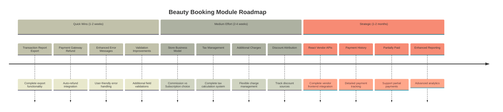
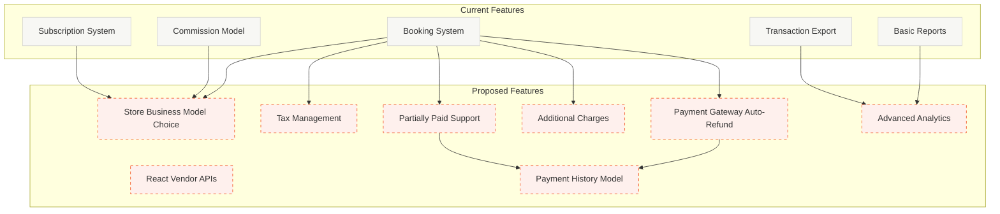

# 🗺️ Beauty Booking Module - Feature Roadmap

## 📊 Executive Summary

This roadmap outlines potential features, improvements, and optimizations for the Beauty Booking module based on comprehensive codebase analysis and comparison with other modules (Food, Grocery, Rental).

---

## 🎯 Timeline Overview

---

## 🔄 Current vs Proposed Architecture

---

## 🚀 Quick Wins (1-2 weeks)

### 1. ✅ Transaction Report Export
**Status**: ✅ **COMPLETED**
- Created `BeautyTransactionReportExport` class
- Created `transaction-report.blade.php` view
- Integrated with `BeautyReportController::transactionReport()`

**Impact**: High - Enables data export for financial analysis

---

### 2. Payment Gateway Auto-Refund
**Status**: ⚠️ **TODO** (Feature, not bug)
- **Current**: Manual refund processing for digital payments
- **Proposed**: Automatic refund via payment gateway API
- **Requirements**:
  - Store payment transaction ID when booking is paid
  - Integrate with Stripe/PayPal/Razorpay refund APIs
  - Handle refund status updates

**Impact**: Medium - Reduces manual work for admins

---

### 3. Enhanced Error Messages
**Status**: ⚠️ **Partial**
- **Current**: Generic error messages
- **Proposed**: Context-specific, user-friendly messages
- **Areas**:
  - Booking creation failures
  - Payment processing errors
  - Validation errors

**Impact**: Medium - Better user experience

---

### 4. Validation Improvements
**Status**: ⚠️ **Partial**
- **Current**: Basic validations exist
- **Proposed**: 
  - Cross-field validation (e.g., booking_date + booking_time)
  - Business rule validation (e.g., salon working hours)
  - Package availability validation

**Impact**: Medium - Prevents invalid bookings

---

## 🔧 Medium Effort (2-4 weeks)

### 5. Store Business Model Integration
**Status**: ⚠️ **Partial**
- **Current**: `store_business_model` exists but not fully integrated
- **Proposed**: 
  - Allow stores to choose between `commission` and `subscription`
  - Update commission calculation based on business model
  - Integrate with subscription system

**Impact**: High - Aligns with other modules, provides flexibility

**Reference**: `BEAUTY_MODULE_MISSING_FEATURES_ANALYSIS.md` - Priority 1

---

### 6. Tax Management
**Status**: ⚠️ **Partial**
- **Current**: Tax fields exist in `BeautyBooking` model
- **Proposed**:
  - Complete tax calculation logic
  - Tax configuration per zone/salon
  - Tax reporting

**Impact**: High - Required for international markets

**Reference**: `BEAUTY_MODULE_MISSING_FEATURES_ANALYSIS.md` - Priority 4

---

### 7. Additional Charges
**Status**: ⚠️ **Partial**
- **Current**: `additional_charge` field exists
- **Proposed**:
  - Admin interface for adding charges
  - Charge types (late fee, cancellation, etc.)
  - Charge attribution

**Impact**: Medium - Flexible pricing model

**Reference**: `BEAUTY_MODULE_MISSING_FEATURES_ANALYSIS.md` - Priority 6

---

### 8. Discount Attribution
**Status**: ⚠️ **Missing**
- **Current**: Discounts applied but not tracked
- **Proposed**:
  - `discount_by` field (admin/vendor)
  - Track discount source
  - Calculate subsidy for discounts

**Impact**: Medium - Better financial tracking

**Reference**: `BEAUTY_MODULE_MISSING_FEATURES_ANALYSIS.md` - Priority 7

---

## 🏗️ Strategic (1-2 months)

### 9. React Vendor API Integration
**Status**: ❌ **Critical Gap**
- **Current**: Zero vendor API calls in React frontend
- **Proposed**: Complete vendor API integration
  - Booking management
  - Calendar management
  - Service/Staff management
  - Financial reports
  - Subscription management

**Impact**: Critical - Vendors cannot use React frontend

**Reference**: `REACT_BEAUTY_MODULE_ALIGNMENT_CHANGES.md`

---

### 10. Payment History Model
**Status**: ⚠️ **Missing**
- **Current**: Payment info in `BeautyTransaction` only
- **Proposed**: 
  - Create `BeautyPayment` model
  - Track payment attempts
  - Store gateway transaction IDs
  - Payment method details

**Impact**: Medium - Better payment tracking

**Reference**: `BEAUTY_MODULE_MISSING_FEATURES_ANALYSIS.md` - Priority 8

---

### 11. Partially Paid Support
**Status**: ⚠️ **Partial**
- **Current**: `partially_paid` status exists but logic incomplete
- **Proposed**:
  - Support multiple payment methods
  - Track partial payments
  - Payment completion workflow

**Impact**: Medium - Flexible payment options

**Reference**: `BEAUTY_MODULE_MISSING_FEATURES_ANALYSIS.md` - Priority 9

---

### 12. Enhanced Reporting & Analytics
**Status**: ⚠️ **Basic**
- **Current**: Basic reports exist
- **Proposed**:
  - Advanced analytics dashboard
  - Revenue breakdown by source
  - Customer behavior analysis
  - Salon performance metrics

**Impact**: High - Better business insights

---

## 🔍 Code Quality Improvements

### Performance Optimizations
- [ ] Add database indexes for frequently queried columns
- [ ] Implement query result caching
- [ ] Optimize N+1 queries with eager loading
- [ ] Add pagination to large datasets

### Security Enhancements
- [ ] Add authorization policies (Laravel Policies)
- [ ] Implement rate limiting for APIs
- [ ] Add input sanitization
- [ ] Enhance CSRF protection

### Developer Experience
- [ ] Add comprehensive PHPDoc comments
- [ ] Create API documentation
- [ ] Add unit tests
- [ ] Improve error logging

---

## 📋 Priority Matrix

| Feature | Priority | Effort | Impact | Status |
|---------|----------|--------|--------|--------|
| Transaction Report Export | High | Low | High | ✅ Completed |
| React Vendor APIs | Critical | High | Critical | ❌ Not Started |
| Store Business Model | High | Medium | High | ⚠️ Partial |
| Tax Management | High | Medium | High | ⚠️ Partial |
| Payment Gateway Refund | Medium | Medium | Medium | ⚠️ TODO |
| Additional Charges | Medium | Medium | Medium | ⚠️ Partial |
| Discount Attribution | Medium | Low | Medium | ❌ Missing |
| Payment History Model | Medium | Medium | Medium | ❌ Missing |
| Partially Paid | Medium | Medium | Medium | ⚠️ Partial |
| Enhanced Reporting | Low | High | High | ⚠️ Basic |

---

## 🎯 Recommended Implementation Order

### Phase 1: Critical Fixes (Week 1-2)
1. ✅ Transaction Report Export (COMPLETED)
2. React Vendor API Integration (Critical)
3. Enhanced Error Messages

### Phase 2: Business Model Alignment (Week 3-6)
4. Store Business Model Integration
5. Tax Management
6. Additional Charges

### Phase 3: Advanced Features (Week 7-10)
7. Payment Gateway Auto-Refund
8. Payment History Model
9. Partially Paid Support
10. Discount Attribution

### Phase 4: Analytics & Optimization (Week 11-12)
11. Enhanced Reporting
12. Performance Optimizations
13. Security Enhancements

---

## 📝 Notes

- All features are based on comparison with Food/Grocery/Rental modules
- Priority is based on business impact and alignment needs
- Effort estimates are approximate and may vary
- Some features may require database migrations

---

**Last Updated**: 2025-12-19
**Status**: Active Development

